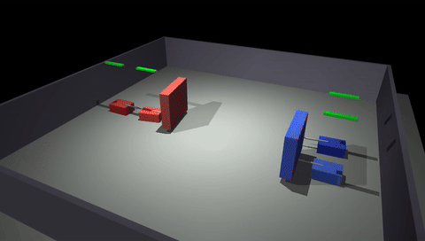
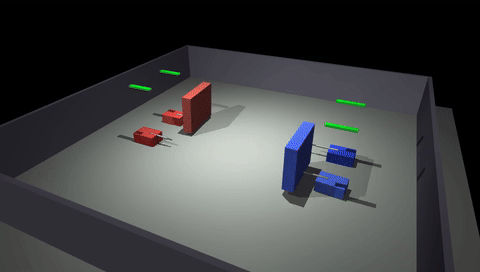
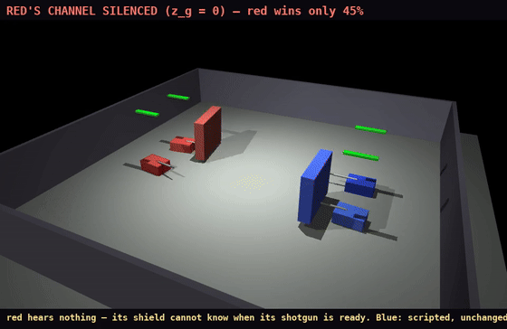

# Dreaming Together — tank-combat testbed for language vs embedding coordination

A 2v2 MuJoCo combat environment where **team communication is provably
causally necessary**, built to test whether **linguistic encoding beats
continuous embedding encoding at exactly matched bandwidth** (40
bits/frame). Experimental companion to the ALIFE 2026 paper *"Dreaming
Itself."*

## See it

**The game** — shields screen volleys until the coordinator calls a firing
window (scripted demo; labeled frame-by-frame in `demo/01_what_is_this/`):



**Communication is causally necessary** — the certified diffusion+language
team, identical spawn and opponent, with its 40-bit channel live vs zeroed:

| Channel live — win in 4.4 s | Channel silenced — ground down |
|---|---|
|  |  |

Full-resolution MP4s: [coordinated](demo/03_communication_matters/comm_on.mp4) ·
[silenced](demo/03_communication_matters/comm_off.mp4) ·
[scripted episode](demo/01_what_is_this/e2e_scripted_combat.mp4) —
and the whole learning arc in [`demo/`](demo/).

**Start here:**

- [`REPORT_STATUS.md`](REPORT_STATUS.md) — current status, certified
  results, demo index, roadmap (2-minute read).
- [`demo/`](demo/) — watch it: the game explained in labeled frames, a
  policy learning to fight from a camera, and the same team winning with
  its channel live vs losing with it silenced.
- [`DESIGN_OF_EXPERIMENT.md`](DESIGN_OF_EXPERIMENT.md) — the failure
  ledger, gates, frozen spec, and hard-won engineering notes.
- [`results/STAGE2_SUMMARY.md`](results/STAGE2_SUMMARY.md) — the numbers.

**Reproduce:**

```bash
python -m pytest tests/ -q                        # 100+ physics/env/gate tests
python tools/e2e_visual_test.py                   # scripted 2v2 episode + video
python tools/gate_g2.py --episodes 200            # combat-signal gate
python -m dreaming_together.training.stage1_combat --workers 8   # Stage 1
python -m dreaming_together.training.stage2_coordination --condition A --workers 8
python -m dreaming_together.training.stage2_diffusion --condition C --seed 1 --workers 8
```

Stack: Python 3.11+, MuJoCo ≥ 3.9, PyTorch ≥ 2.4 (CUDA), single
consumer GPU (developed on an RTX 5070 Ti, <2 GB VRAM used).

Training checkpoints and raw progress videos are not tracked in git
(`runs/`, `videos/`); the curated `demo/` folder carries the presentable
artifacts.
